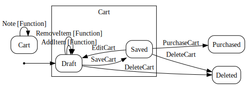

<!--Generated-->
# PowerShell examples

Scripts `*.stateless.ps1` are for `Invoke-Stateless`, the interactive loop with
checkpoints. The workflow may be interrupted and resumed later in the same or
new session.

Other scripts use `Invoke-StateMachine` and may be invoked directly. They are
simple interactive prompt for choice loops, not persistent.

**Scripts**

- [All-Action-Menu.ps1](All-Action-Menu.ps1) - Hierarchical menu of examples by groups: Tools, Simple, Persistent.
- [All-Choice-Menu.ps1](All-Choice-Menu.ps1) - Hierarchical menu of examples by groups: Tools, Simple, Persistent.
- [Cart.ps1](Cart.ps1) - Shopping cart interactive workflow with some input.
- [EditFlags.ps1](EditFlags.ps1) - Setting/unsetting enum flags interactively using state machine loop.
- [EditProperties.ps1](EditProperties.ps1) - Setting object properties interactively using state machine loop.
- [OnOff.ps1](OnOff.ps1) - Simple on/off example with external state storage.
- [Phone.ps1](Phone.ps1) - Runs Phone.stateless.ps1 by Invoke-StateMachine.
- [Phone.stateless.ps1](Phone.stateless.ps1) - State machine script for Invoke-Stateless or Invoke-StateMachine.
- [Steps.ps1](Steps.ps1) - Runs Steps.stateless.ps1 by Invoke-StateMachine.
- [Steps.stateless.ps1](Steps.stateless.ps1) - State machine script for Invoke-Stateless or Invoke-StateMachine.

## All-Action-Menu.ps1

## All-Choice-Menu.ps1

## Cart.ps1

## EditFlags.ps1

## EditProperties.ps1

## OnOff.ps1

## Phone.ps1

## Steps.ps1

